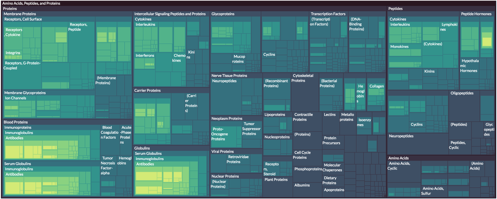
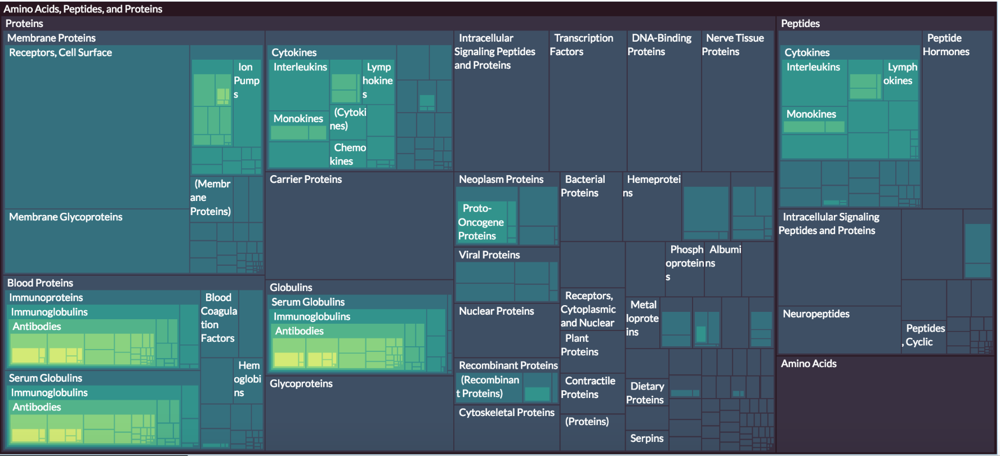
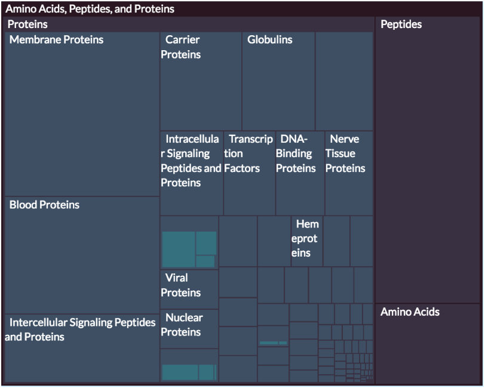

# treecut.js

treecut.js automatically adjusts the level of abstraction of treemaps
as a function of display size.

The abstraction is determined by a tree cut, which is essentially a 
boundary between the visible and hidden parts of the tree.

The tree cut selection algorithm is based on the Minimum Description Length principle. 
To reduce clutter when space is scarce, it sets the cut above subtrees that have more uniform scores.

##Usage

### With d3.hierarchy

Get your tree ready with d3.hierarchy as usual:

```javascript
var tree =  d3.hierarchy(data);
    .sum(function(d) { return d.children ? d.value : 0; })
    .sort(function(a,b){ return b.value - a.value; });

```

Then let treecut.js adorn it with its own attributes:

```javascript
var treecut = vialab.treecut;
treecut.hierarchy()
    .adornD3(tree);
```

Extract the cut.

```javascript
var cut = treecut.treemap()
    .findcut(tree, 800*600); // 800*600 is the display area, in pixels
```

`findcut` returns an array of nodes that belong to the cut. You can mark the nodes
under the cut as invisible before drawing the treemap:

```javascript
cut.forEach(function(d){
    d.descendants().forEach(function(o,i){
      if (i==0) return;
      o.visible = false;
    });
});
```

## Example





## Demos

Load the pages on windows of different size to see how the treemap adapts.

### MeSH - Medical Subject Headings

MeSH is a hierarchy of 56,327 categories used to tag PubMed publications. The size of a category encodes the number of papers contained in it. For each category A, a child named (A) represents the number of papers tagged **directly** with A.

**Link:** http://vialab.science.uoit.ca/mesh/treemap.html

You can compare the view above with the [unabstracted MeSH treemap](http://vialab.science.uoit.ca/mesh/vanilla-treemap.html). 

### DMOZ (Directory Mozilla)

DMOZ is a hierarchical web directory of nearly half a million categories.

**Link:** http://vialab.science.uoit.ca/treemapcut/dmoz.html

##Citation

R. Veras; C. Collins, ["Optimizing Hierarchical Visualizations with the Minimum Description Length Principle,"](http://ieeexplore.ieee.org/stamp/stamp.jsp?tp=&arnumber=7536174&isnumber=4359476) in IEEE Transactions on Visualization and Computer Graphics , vol.PP, no.99, pp.1-1.

```
@article{Veras2016, 
author={R. Veras and C. Collins}, 
journal={IEEE Transactions on Visualization and Computer Graphics}, 
title={Optimizing Hierarchical Visualizations with the Minimum Description Length Principle}, 
year={2016}, 
volume={PP}, 
number={99}, 
pages={1-1}
}
```
